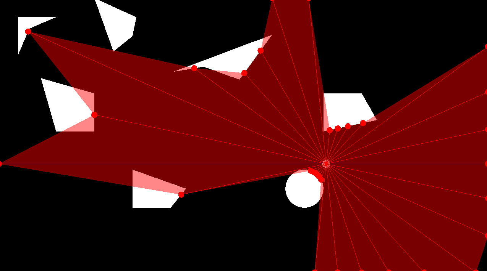

# RayCasting

## Description
This project showcases examples of ray casting in a 2D space.

## Installation
To build this project, you need the following:
* C++20
* SFML library
* Visual studio 2022 (with Game Development with C++ enabled)

Please refer to the following page for instructions on how to set up your environment.

[```SFML Visual Studio Setup Tutorial```](https://www.sfml-dev.org/tutorials/2.6/start-vc.php)

## How to Use
Download the ```RayCasting.exe``` file in the repository and execute it.

You can switch between fives different scenes by clicking the designated keys:
* Scene 1 (Stationary Ray Caster) : 1 key
* Scene 2 (Radial Ray Caster) : 2 key
* Scene 3 (Radial Ray Caster with triangles) : 3 key
* Scene 4 (Vertex Ray Caster with triangles) : 4 key
* Scene 5 (Vertex Ray Caster with triangles, without ray visualizaition) : 5 key
## Images


| Scene 1 | Scene 2 |
| --- | --- |
|  |  |

| Scene 3 | Scene 4 |
| --- | --- |
|  |  |

| Scene 5                   |
|---------------------------| 
|  | 
